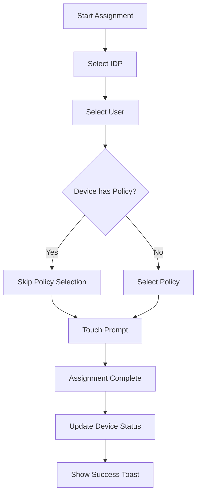
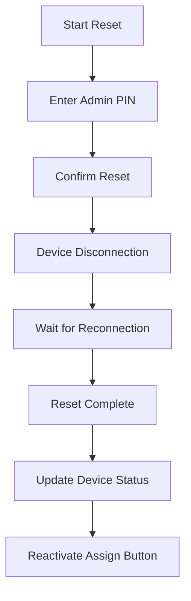
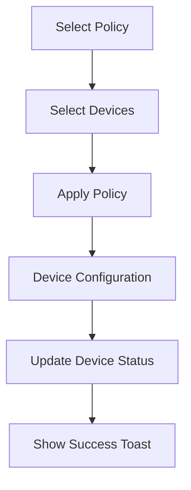

# F1 FIDO Key Manager - Technical Specifications

## 📋 System Overview

The F1 FIDO Key Manager is a React-based web application for enterprise FIDO security key management. This document provides comprehensive technical specifications for the current implementation (branch-61).

## 🏗️ Architecture

### Frontend Architecture
```
┌─────────────────────────────────────────────────────────────┐
│                    React Application                        │
├─────────────────────────────────────────────────────────────┤
│  Components Layer                                           │
│  ├── Dashboard                                              │
│  ├── FidoKeyManagement (Core Component)                     │
│  ├── PolicyManagement                                       │
│  ├── Inventory                                              │
│  ├── AuditLogs                                              │
│  ├── IdpSettings                                            │
│  └── UI Components (Toast, Pagination, etc.)               │
├─────────────────────────────────────────────────────────────┤
│  State Management Layer                                     │
│  ├── Component State (React Hooks)                         │
│  ├── Local Storage                                          │
│  └── Session Management                                     │
├─────────────────────────────────────────────────────────────┤
│  Styling System                                             │
│  ├── Global Styles (Design Tokens)                         │
│  ├── Component Styles                                       │
│  └── Responsive Design                                      │
├─────────────────────────────────────────────────────────────┤
│  API Integration Layer                                      │
│  ├── REST API Client                                        │
│  ├── WebSocket Client                                       │
│  └── Error Handling                                         │
└─────────────────────────────────────────────────────────────┘
                              │
                              ▼
┌─────────────────────────────────────────────────────────────┐
│                    Backend Services                         │
├─────────────────────────────────────────────────────────────┤
│  FIDO Key Management Service                                │
│  ├── Device Discovery                                       │
│  ├── Policy Application                                     │
│  ├── User Assignment                                        │
│  └── Device Reset                                           │
├─────────────────────────────────────────────────────────────┤
│  Identity Provider Integration                              │
│  ├── Entra ID (Azure AD)                                    │
│  ├── STA (Security Token Authority)                         │
│  └── User Directory Services                                │
├─────────────────────────────────────────────────────────────┤
│  Audit & Logging Service                                    │
│  ├── Event Tracking                                         │
│  ├── Compliance Reporting                                   │
│  └── Data Export                                            │
└─────────────────────────────────────────────────────────────┘
```

## 🔧 Technology Stack

### Frontend Technologies
- **React**: 18.2.0 (Functional components with hooks)
- **Vite**: 6.3.5 (Build tool and development server)
- **Lucide React**: Icon library for consistent iconography
- **JavaScript**: ES6+ with modern syntax
- **CSS**: Custom CSS with design tokens
- **HTML5**: Semantic markup with accessibility features

### Development Tools
- **Node.js**: 18+ (Runtime environment)
- **npm**: Package management
- **ESLint**: Code linting and quality
- **Prettier**: Code formatting
- **Git**: Version control

### Browser Support
- **Chrome**: 90+
- **Firefox**: 88+
- **Safari**: 14+
- **Edge**: 90+
- **Mobile**: iOS Safari 14+, Chrome Mobile 90+

## 📊 Data Models

### Device Model
```typescript
interface Device {
  id: string;                    // Unique device identifier
  name: string;                  // Human-readable device name
  manufacturer: string;          // Device manufacturer (Yubico, Thales, etc.)
  model: string;                 // Device model number
  serialNumber: string;          // Device serial number
  status: DeviceStatus;          // Current device status
  version: string;               // Firmware version
  aaguid: string;                // Authenticator GUID
  fidoVersion: string;           // FIDO protocol version
  capabilities: string[];        // Device capabilities (FIDO2, PIV, OTP)
  lastSeen: string;              // Last connection timestamp
  hasAdminPin: boolean;          // Admin PIN status
  configuredPolicy: Policy | null;  // Applied policy
  assignedUser: User | null;     // Assigned user
  assignedIdp: string | null;    // Identity provider
  createdAt: string;             // Creation timestamp
  updatedAt: string;             // Last update timestamp
}

type DeviceStatus = 'Connected' | 'Assigned' | 'Configured' | 'Offline' | 'Error';
```

### Policy Model
```typescript
interface Policy {
  id: string;                    // Unique policy identifier
  name: string;                  // Policy name
  description: string;           // Policy description
  type: PolicyType;              // Policy type
  status: PolicyStatus;          // Policy status
  configuration: PolicyConfig;   // Policy configuration
  appliedDevices: number;        // Number of applied devices
  createdBy: string;             // Creator user ID
  createdAt: string;             // Creation timestamp
  updatedAt: string;             // Last update timestamp
}

type PolicyType = 'authentication' | 'device' | 'user';
type PolicyStatus = 'active' | 'inactive' | 'draft';

interface PolicyConfig {
  authentication: {
    pinRequired: boolean;
    pinComplexity: 'low' | 'medium' | 'high';
    biometricEnabled: boolean;
    timeout: number;             // Session timeout in seconds
    maxRetries: number;          // Maximum retry attempts
    lockoutDuration: number;     // Lockout duration in minutes
  };
  device?: {
    allowedTypes: string[];      // Allowed device types
    requiredFirmware: string;    // Minimum firmware version
    allowedConnections: string[]; // Allowed connection types
  };
  user?: {
    allowedRoles: string[];      // Allowed user roles
    departmentRestrictions: string[];
    timeRestrictions: {
      allowedHours: {
        start: string;           // HH:MM format
        end: string;             // HH:MM format
      };
      allowedDays: number[];     // Days of week (1-7)
    };
  };
}
```

### User Model
```typescript
interface User {
  id: string;                    // Unique user identifier
  username: string;              // Username
  email: string;                 // Email address
  firstName: string;             // First name
  lastName: string;              // Last name
  role: UserRole;                // User role
  department: string;            // Department
  title: string;                 // Job title
  status: UserStatus;            // User status
  assignedDevices: AssignedDevice[]; // Assigned devices
  lastLogin: string;             // Last login timestamp
  createdAt: string;             // Creation timestamp
  updatedAt: string;             // Last update timestamp
}

type UserRole = 'admin' | 'manager' | 'employee';
type UserStatus = 'active' | 'inactive' | 'suspended';

interface AssignedDevice {
  deviceId: string;
  deviceName: string;
  assignedAt: string;
}
```

### Audit Log Model
```typescript
interface AuditLog {
  id: string;                    // Unique log entry identifier
  timestamp: string;             // Event timestamp (ISO 8601)
  eventType: EventType;          // Type of event
  severity: Severity;            // Event severity
  userId: string;                // User who performed action
  userName: string;              // User display name
  resourceType: ResourceType;    // Type of resource affected
  resourceId: string;            // Resource identifier
  action: string;                // Action performed
  details: Record<string, any>;  // Additional event details
  ipAddress: string;             // Client IP address
  userAgent: string;             // Client user agent
  sessionId: string;             // Session identifier
}

type EventType = 'device_assignment' | 'policy_application' | 'user_login' | 'device_reset' | 'configuration_change';
type Severity = 'info' | 'warning' | 'error' | 'critical';
type ResourceType = 'device' | 'policy' | 'user' | 'system';
```

## 🔄 State Management

### Component State Architecture
```javascript
// FidoKeyManagement Component State
const FidoKeyManagement = () => {
  // Service Connection State
  const [isServiceConnected, setIsServiceConnected] = useState(false);
  const [connectedDevices, setConnectedDevices] = useState([]);
  const [isConnecting, setIsConnecting] = useState(false);
  const [connectionError, setConnectionError] = useState('');

  // UI State
  const [showDeviceModal, setShowDeviceModal] = useState(false);
  const [showConfigureModal, setShowConfigureModal] = useState(false);
  const [showAssignUserModal, setShowAssignUserModal] = useState(false);
  const [showResetModal, setShowResetModal] = useState(false);

  // Selection State
  const [selectedDevice, setSelectedDevice] = useState(null);
  const [selectedDevices, setSelectedDevices] = useState(new Set());
  const [selectedIDP, setSelectedIDP] = useState('');
  const [selectedUser, setSelectedUser] = useState('');
  const [selectedPolicy, setSelectedPolicy] = useState('');

  // Flow State
  const [assignUserStep, setAssignUserStep] = useState(1);
  const [resetStep, setResetStep] = useState(1);

  // Data State
  const [userSearchQuery, setUserSearchQuery] = useState('');
  const [searchResults, setSearchResults] = useState([]);
  const [isSearching, setIsSearching] = useState(false);

  // Pagination State
  const [currentPage, setCurrentPage] = useState(1);
  const [itemsPerPage, setItemsPerPage] = useState(20);

  // Error State
  const [resetError, setResetError] = useState('');
  const [assignError, setAssignError] = useState('');
};
```

### State Update Patterns
```javascript
// Device Status Update Pattern
const updateDeviceStatus = (deviceId, newStatus, additionalData = {}) => {
  setConnectedDevices(prev => prev.map(device => 
    device.id === deviceId 
      ? { ...device, status: newStatus, ...additionalData }
      : device
  ));
};

// Multi-Device Selection Pattern
const handleDeviceSelection = (deviceId, isSelected) => {
  const newSelection = new Set(selectedDevices);
  if (isSelected && newSelection.size < 20) {
    newSelection.add(deviceId);
  } else {
    newSelection.delete(deviceId);
  }
  setSelectedDevices(newSelection);
};

// Flow Navigation Pattern
const handleAssignUserNext = () => {
  if (assignUserStep === 1 && selectedIDP) {
    setAssignUserStep(2);
  } else if (assignUserStep === 2 && selectedUser) {
    // Smart policy flow: skip if device already has policy
    if (selectedDevice && selectedDevice.configuredPolicy) {
      setShowTouchPrompt(true);
    } else {
      setAssignUserStep(3);
    }
  } else if (assignUserStep === 3 && selectedPolicy) {
    setShowTouchPrompt(true);
  }
};
```

## 🎨 Design System

### Color Palette
```javascript
// Primary Colors
const primaryColors = {
  50: '#eff6ff',   // Lightest blue
  100: '#dbeafe',
  200: '#bfdbfe',
  300: '#93c5fd',
  400: '#60a5fa',
  500: '#041295',  // F1 Brand Blue (Primary)
  600: '#2563eb',
  700: '#1d4ed8',
  800: '#1e40af',
  900: '#1e3a8a'   // Darkest blue
};

// Semantic Colors
const semanticColors = {
  success: {
    bg: '#f0fdf4',     // Light green background
    border: '#bbf7d0', // Green border
    text: '#166534'    // Dark green text
  },
  error: {
    bg: '#fef2f2',     // Light red background
    border: '#fecaca', // Red border
    text: '#991b1b'    // Dark red text
  },
  warning: {
    bg: '#fffbeb',     // Light yellow background
    border: '#fed7aa', // Orange border
    text: '#92400e'    // Dark orange text
  },
  info: {
    bg: '#eff6ff',     // Light blue background
    border: '#bfdbfe', // Blue border
    text: '#1e40af'    // Dark blue text
  }
};

// Header Colors (Updated)
const headerColors = {
  bg: '#131319',       // Dark gray background
  text: '#ffffff',     // White text
  border: '#374151'    // Gray border
};
```

### Typography Scale
```javascript
const typography = {
  // Page Headers
  pageTitle: {
    fontSize: '1.875rem',  // 30px
    fontWeight: '600',
    lineHeight: '1.2',
    color: '#111827'
  },
  
  // Section Headers
  h1: {
    fontSize: '1.5rem',    // 24px
    fontWeight: '600',
    color: '#111827'
  },
  h2: {
    fontSize: '1.25rem',   // 20px
    fontWeight: '500',
    color: '#111827'
  },
  h3: {
    fontSize: '1.125rem',  // 18px
    fontWeight: '500',
    color: '#111827'
  },
  
  // Body Text
  body1: {
    fontSize: '1rem',      // 16px
    fontWeight: '400',
    color: '#374151'
  },
  body2: {
    fontSize: '0.875rem',  // 14px
    fontWeight: '400',
    color: '#4b5563'
  },
  
  // Small Text
  caption: {
    fontSize: '0.75rem',   // 12px
    fontWeight: '400',
    color: '#6b7280'
  }
};
```

### Spacing System
```javascript
const spacing = {
  xs: '0.25rem',    // 4px
  sm: '0.5rem',     // 8px
  md: '1rem',       // 16px
  lg: '1.5rem',     // 24px
  xl: '2rem',       // 32px
  '2xl': '3rem',    // 48px
  '3xl': '4rem',    // 64px
  '4xl': '6rem'     // 96px
};
```

### Component Specifications

#### Button Specifications
```javascript
const buttonSpecs = {
  primary: {
    height: '40px',
    padding: '10px 16px',
    borderRadius: '6px',
    fontSize: '14px',
    fontWeight: '500',
    minWidth: '80px',
    backgroundColor: '#041295',
    color: '#ffffff',
    border: 'none',
    cursor: 'pointer',
    transition: 'all 0.2s ease-in-out',
    
    // States
    hover: {
      backgroundColor: '#1d4ed8',
      transform: 'translateY(-1px)',
      boxShadow: '0 4px 8px rgba(0, 0, 0, 0.1)'
    },
    active: {
      backgroundColor: '#1e3a8a',
      transform: 'translateY(0)'
    },
    disabled: {
      backgroundColor: '#9ca3af',
      cursor: 'not-allowed',
      opacity: 0.5
    }
  },
  
  secondary: {
    height: '40px',
    padding: '10px 16px',
    borderRadius: '6px',
    fontSize: '14px',
    fontWeight: '500',
    minWidth: '80px',
    backgroundColor: '#ffffff',
    color: '#374151',
    border: '1px solid #d1d5db',
    cursor: 'pointer',
    transition: 'all 0.2s ease-in-out',
    
    // States
    hover: {
      backgroundColor: '#f9fafb',
      borderColor: '#9ca3af'
    },
    active: {
      backgroundColor: '#f3f4f6'
    }
  }
};
```

#### Input Specifications
```javascript
const inputSpecs = {
  default: {
    height: '40px',
    padding: '10px 12px',
    borderRadius: '6px',
    fontSize: '14px',
    backgroundColor: '#ffffff',
    color: '#111827',
    border: '1px solid #d1d5db',
    outline: 'none',
    transition: 'all 0.2s ease-in-out',
    
    // States
    focus: {
      borderColor: '#041295',
      boxShadow: '0 0 0 3px rgba(4, 18, 149, 0.1)'
    },
    error: {
      borderColor: '#ef4444',
      boxShadow: '0 0 0 3px rgba(239, 68, 68, 0.1)'
    },
    disabled: {
      backgroundColor: '#f9fafb',
      color: '#9ca3af',
      cursor: 'not-allowed'
    }
  }
};
```

#### Modal Specifications
```javascript
const modalSpecs = {
  overlay: {
    position: 'fixed',
    top: 0,
    left: 0,
    right: 0,
    bottom: 0,
    backgroundColor: 'rgba(0, 0, 0, 0.5)',
    zIndex: 1000,
    display: 'flex',
    alignItems: 'center',
    justifyContent: 'center'
  },
  
  container: {
    backgroundColor: '#ffffff',
    borderRadius: '8px',
    boxShadow: '0 20px 25px -5px rgba(0, 0, 0, 0.1)',
    maxWidth: '500px',
    width: '90%',
    maxHeight: '90vh',
    overflow: 'auto'
  },
  
  header: {
    padding: '24px 24px 0',
    borderBottom: '1px solid #e5e7eb'
  },
  
  body: {
    padding: '24px'
  },
  
  footer: {
    padding: '0 24px 24px',
    display: 'flex',
    justifyContent: 'flex-end',
    gap: '12px'
  }
};
```

## 🔄 Flow Specifications

### Device Assignment Flow


### Device Reset Flow


### Policy Application Flow


## 📱 Responsive Design

### Breakpoint System
```javascript
const breakpoints = {
  sm: '640px',    // Small devices (phones)
  md: '768px',    // Medium devices (tablets)
  lg: '1024px',   // Large devices (laptops)
  xl: '1280px',   // Extra large devices (desktops)
  '2xl': '1536px' // 2X large devices (large desktops)
};
```

### Mobile Optimizations
- **Touch Targets**: Minimum 44px for touch interactions
- **Navigation**: Collapsible sidebar on mobile
- **Tables**: Horizontal scroll with sticky columns
- **Modals**: Full-screen on mobile devices
- **Typography**: Responsive font scaling

## ♿ Accessibility Specifications

### WCAG 2.2 AA Compliance
- **Color Contrast**: Minimum 4.5:1 for normal text, 3:1 for large text
- **Keyboard Navigation**: Full keyboard accessibility
- **Screen Readers**: Proper ARIA labels and semantic HTML
- **Focus Management**: Visible focus indicators
- **Alternative Text**: Images and icons have descriptive alt text

### Accessibility Implementation
```javascript
// Example: Accessible button
<button
  aria-label="Assign device to user"
  role="button"
  tabIndex={0}
  onKeyDown={(e) => {
    if (e.key === 'Enter' || e.key === ' ') {
      handleAssignUser(device);
    }
  }}
>
  <UserPlus className="w-4 h-4" />
  Assign
</button>

// Example: Accessible form
<form role="form" aria-labelledby="form-title">
  <h2 id="form-title">Device Configuration</h2>
  <label htmlFor="policy-select">Select Policy</label>
  <select 
    id="policy-select"
    aria-describedby="policy-help"
    required
  >
    <option value="">Choose a policy</option>
  </select>
  <div id="policy-help" className="sr-only">
    Select a security policy to apply to this device
  </div>
</form>
```

## 🚀 Performance Specifications

### Bundle Size Targets
- **JavaScript**: < 350KB (< 90KB gzipped)
- **CSS**: < 120KB (< 20KB gzipped)
- **Total**: < 500KB initial load

### Performance Metrics
- **First Contentful Paint**: < 1.5s
- **Largest Contentful Paint**: < 2.5s
- **Time to Interactive**: < 3.5s
- **Cumulative Layout Shift**: < 0.1

### Optimization Techniques
- **Code Splitting**: Lazy loading of components
- **Tree Shaking**: Remove unused code
- **Minification**: Compress JavaScript and CSS
- **Caching**: Browser and CDN caching strategies

## 🔐 Security Specifications

### Authentication
- **Token-based**: JWT tokens for API authentication
- **Session Management**: Secure session handling
- **Token Refresh**: Automatic token renewal
- **Logout**: Secure session termination

### Data Protection
- **Input Validation**: Client-side and server-side validation
- **XSS Prevention**: Content Security Policy and input sanitization
- **CSRF Protection**: Anti-CSRF tokens
- **Secure Communication**: HTTPS only

### Error Handling
- **User-Friendly Messages**: No sensitive information in error messages
- **Logging**: Comprehensive error logging for debugging
- **Fallback UI**: Graceful degradation on errors

---

This technical specification provides comprehensive details for the F1 FIDO Key Manager implementation, suitable for AI tool development and system integration.

